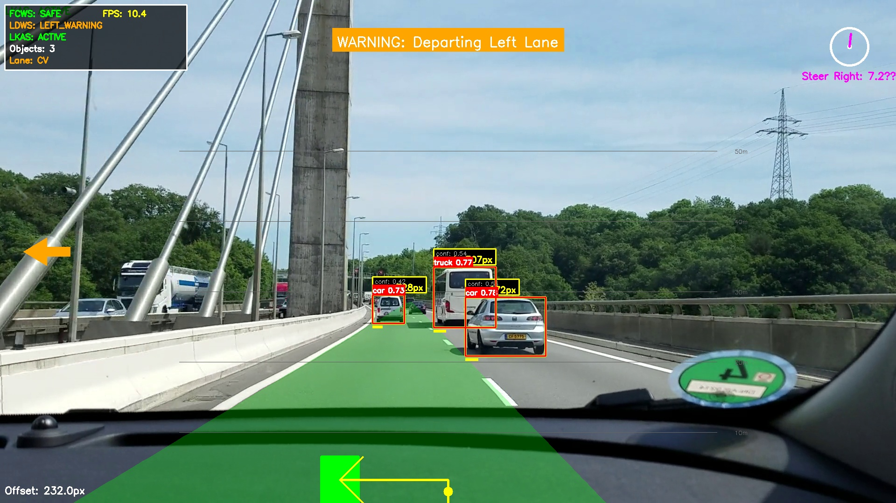
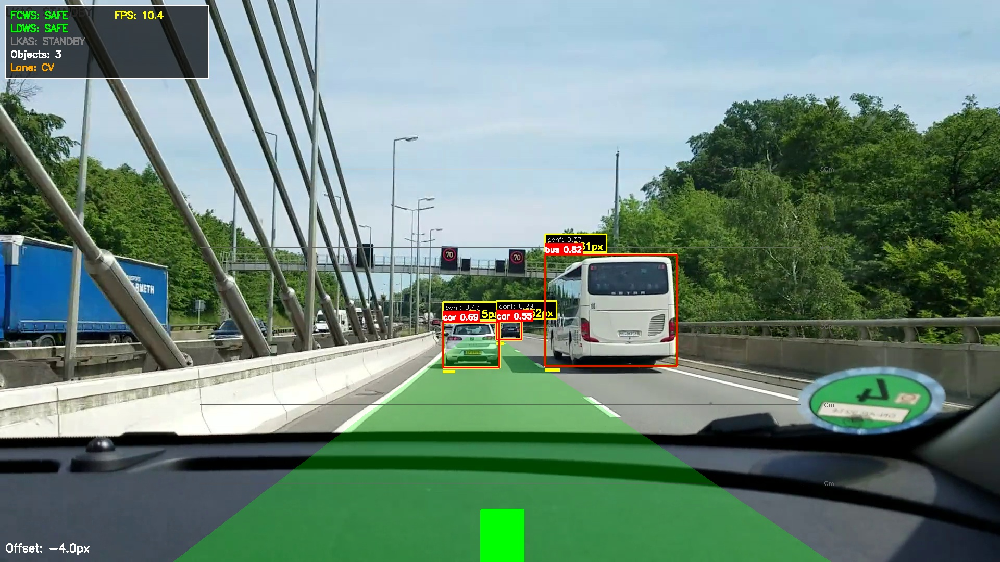
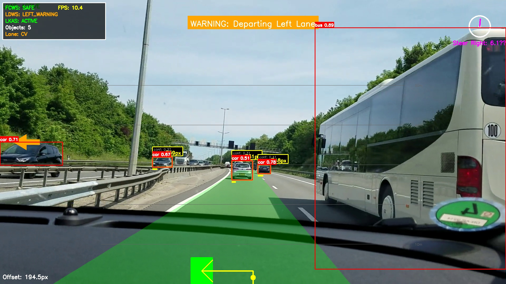

# Advanced Driver Assistance System (ADAS)
## Deep Learning-Enhanced Lane Detection with Real-Time Collision Warning

[](https://www.python.org/)
[](https://opencv.org/)
[](https://github.com/ultralytics/ultralytics)
[](https://flask.palletsprojects.com/)

---

## 🎥 System Demo

Watch the ADAS system in action processing real-world driving scenarios:

<div align="center">


**[📹 Full Video (MP4)](demo_output/output_video.mp4)** | **[📊 Performance Report](demo_output/processing_report.txt)**

</div>

> **Demo Video**: Complete demonstration showing real-time lane detection, forward collision warning, lane departure alerts, and lane keeping assistance working simultaneously. The video showcases the system processing 825 frames with an average of 2.79 detections per frame, achieving 85.8% safe driving conditions with timely warnings for potential hazards.

**Quick Stats from Demo**:
- ✅ 825 frames processed | 8.19 FPS average
- 🚗 2,304 object detections | 2.79 avg per frame  
- ⚠️ 103 warning events | 14 critical alerts
- 🎯 All ADAS features operational

*For detailed performance metrics, see the [System Performance](#-system-performance) section.*

---

## 📋 Table of Contents
- [Project Overview](#-project-overview)
- [System Architecture](#-system-architecture)
- [Key Features](#-key-features)
- [Technical Implementation](#-technical-implementation)
- [Installation & Setup](#-installation--setup)
- [Usage Guide](#-usage-guide)
- [System Performance](#-system-performance)
- [Demo Results](#-demo-results)
- [Project Structure](#-project-structure)
- [Testing & Validation](#-testing--validation)
- [Future Enhancements](#-future-enhancements)
- [References](#-references)

---

## 🎯 Project Overview

This project implements a comprehensive **Advanced Driver Assistance System (ADAS)** that integrates multiple safety features to enhance driving safety through real-time video analysis. The system combines state-of-the-art deep learning models with traditional computer vision techniques to provide robust and reliable driver assistance.

### Core Modules

1. **Forward Collision Warning System (FCWS)** - Detects vehicles and obstacles ahead, calculates collision risk, and provides timely warnings
2. **Lane Departure Warning System (LDWS)** - Monitors vehicle position within lane boundaries and alerts on unintended departures
3. **Lane Keeping Assistance System (LKAS)** - Provides steering guidance to maintain optimal lane positioning

### Project Context

This system was developed as a **Software Engineering project** demonstrating:
- Requirements analysis and specification
- System design and architecture
- Implementation of complex algorithms
- Integration of multiple technologies
- Testing and validation methodologies
- Professional documentation practices

---

## 🏗️ System Architecture

The system follows a modular architecture with clear separation of concerns:

```
┌─────────────────────────────────────────────────────────────┐
│                     Web Interface (Flask)                    │
│  ┌──────────────┐  ┌──────────────┐  ┌──────────────┐      │
│  │ Video Upload │  │ Live Stream  │  │ Config Panel │      │
│  └──────────────┘  └──────────────┘  └──────────────┘      │
└────────────────────────────┬────────────────────────────────┘
                             │
┌────────────────────────────▼────────────────────────────────┐
│                    ADAS System Core                          │
│  ┌──────────────────────────────────────────────────────┐   │
│  │           Frame Processing Pipeline                   │   │
│  │  ┌────────┐  ┌────────┐  ┌────────┐  ┌────────┐    │   │
│  │  │ Input  │→ │ Detect │→ │ Overlay│→ │ Output │    │   │
│  │  └────────┘  └────────┘  └────────┘  └────────┘    │   │
│  └──────────────────────────────────────────────────────┘   │
│                                                               │
│  ┌──────────────┐  ┌──────────────┐  ┌──────────────┐      │
│  │   DL Lane    │  │   YOLOv8     │  │   Fallback   │      │
│  │   Detector   │  │   Object     │  │   CV Lane    │      │
│  │              │  │   Detector   │  │   Detector   │      │
│  └──────────────┘  └──────────────┘  └──────────────┘      │
│                                                               │
│  ┌──────────────┐  ┌──────────────┐  ┌──────────────┐      │
│  │   Advanced   │  │   Animation  │  │   Bird's Eye │      │
│  │   Overlay    │  │   Engine     │  │   Transform  │      │
│  │   Renderer   │  │              │  │              │      │
│  └──────────────┘  └──────────────┘  └──────────────┘      │
└───────────────────────────────────────────────────────────┘
```

### Design Principles

- **Modularity**: Each component is independently testable and replaceable
- **Robustness**: Fallback mechanisms ensure continuous operation
- **Performance**: Optimized for real-time processing (≥15 FPS target)
- **Extensibility**: Easy to add new detection models or features
- **Usability**: Both CLI and web interfaces for different use cases

---

## ✨ Key Features

### 1. Forward Collision Warning System (FCWS)

- **YOLOv8-based Object Detection**: Utilizes state-of-the-art deep learning for accurate vehicle and obstacle detection
- **Real-time Distance Estimation**: Calculates distance to detected objects using bounding box analysis
- **Multi-level Warning System**: 
  - ✅ SAFE: No collision risk detected
  - ⚠️ WARNING: Potential collision risk (distance < 150 pixels)
  - 🚨 CRITICAL: Immediate collision risk (distance < 80 pixels)
- **Visual Indicators**: Color-coded bounding boxes and distance markers
- **Forward Path Filtering**: Focuses on objects in the vehicle's trajectory

### 2. Lane Departure Warning System (LDWS)

- **Hybrid Detection Approach**: 
  - Deep learning-based lane detection for complex scenarios
  - Traditional CV fallback for reliability
- **Lane Position Monitoring**: Continuous tracking of vehicle position relative to lane center
- **Departure Detection**: Alerts when vehicle drifts beyond threshold (default: 30 pixels)
- **Directional Warnings**: Indicates left or right departure
- **Visual Feedback**: Lane overlay with center line and position indicators

### 3. Lane Keeping Assistance System (LKAS)

- **Steering Angle Calculation**: Computes recommended steering correction
- **Visual Guidance**: Animated steering wheel indicator
- **Proportional Assistance**: Correction magnitude based on departure severity
- **Smooth Transitions**: Gradual activation and deactivation

### 4. Advanced Visualization

- **Professional Overlays**: Semi-transparent lane polygons and warning banners
- **Bird's Eye View**: Top-down perspective transformation for spatial awareness
- **Smooth Animations**: Fade transitions and pulsing effects for warnings
- **Performance Metrics**: Real-time FPS and processing time display
- **Configurable Display**: Toggle individual overlay components

### 5. Web Interface

- **Browser-based Access**: No installation required for end users
- **Real-time Streaming**: Live video feed with processed overlays
- **Video Upload**: Process pre-recorded videos
- **Interactive Controls**: Adjust thresholds and settings on-the-fly
- **Status Dashboard**: Real-time system status and warnings
- **Responsive Design**: Works on desktop and mobile devices

---

## 🔧 Technical Implementation

### Technologies Used

| Component | Technology | Purpose |
|-----------|-----------|---------|
| Object Detection | YOLOv8 (Ultralytics) | Real-time vehicle and obstacle detection |
| Lane Detection | Deep Learning + OpenCV | Hybrid approach for robust lane detection |
| Computer Vision | OpenCV 4.8+ | Image processing and transformations |
| Deep Learning | PyTorch / ONNX | Neural network inference |
| Web Framework | Flask 2.3+ | Web interface and API |
| Frontend | HTML5, CSS3, JavaScript | User interface |
| Video Processing | OpenCV VideoCapture/Writer | Video I/O operations |

### Algorithms & Techniques

#### Object Detection Pipeline
1. **Preprocessing**: Frame resizing and normalization
2. **Inference**: YOLOv8 forward pass
3. **Post-processing**: Non-maximum suppression (NMS)
4. **Filtering**: Forward path region of interest (ROI)
5. **Distance Estimation**: Bounding box size and position analysis

#### Lane Detection Pipeline
1. **DL Detection**: 
   - Model input preprocessing (resize, normalize)
   - Neural network inference
   - Lane polynomial extraction
   - Confidence scoring
2. **CV Fallback** (if DL confidence < threshold):
   - Grayscale conversion
   - Gaussian blur
   - Canny edge detection
   - Region of interest masking
   - Hough line transform
   - Lane line separation and fitting

#### Overlay Rendering
- **Alpha Blending**: Semi-transparent overlays using cv2.addWeighted()
- **Perspective Transform**: Bird's eye view using cv2.getPerspectiveTransform()
- **Animation Engine**: Time-based interpolation with easing functions
- **Text Rendering**: Anti-aliased text with background boxes

### Performance Optimizations

- **Model Selection**: YOLOv8n (nano) for optimal speed/accuracy trade-off
- **Frame Skipping**: Adaptive frame rate based on processing latency
- **Caching**: Transformation matrices and static overlays
- **Vectorization**: NumPy operations for batch processing
- **GPU Acceleration**: CUDA support for compatible hardware

---

## 📦 Installation & Setup

### Prerequisites

- **Python**: 3.8 or higher
- **Operating System**: Windows, Linux, or macOS
- **GPU** (Optional): CUDA-capable NVIDIA GPU for faster inference
- **Webcam** (Optional): For real-time testing

### Step 1: Clone Repository

```bash
git clone <repository-url>
cd ADAS_Project
```

### Step 2: Install Dependencies

```bash
pip install -r requirements.txt
```

### Step 3: Verify Installation

```bash
python -c "import cv2, torch, ultralytics; print('Installation successful!')"
```

### Step 4: Download Models

The YOLOv8 model will be automatically downloaded on first run. For custom lane detection models:

```bash
# Place your ONNX/PyTorch models in the models/ directory
# Update config/adas_config.yaml with model paths
```

---

## 🚀 Usage Guide

### Command Line Interface

#### Basic Usage (Webcam)
```bash
python main.py
```

#### Process Video File
```bash
python main.py --input demo_output/test_video.mp4
```

#### Save Output Video
```bash
python main.py --input input.mp4 --output output.mp4
```

#### Advanced Options
```bash
python main.py \
  --input video.mp4 \
  --output processed.mp4 \
  --model yolov8s.pt \
  --conf 0.6 \
  --no-display
```

### Web Application

#### Start Server
```bash
python app.py
```

#### Access Interface
Open your browser and navigate to: `http://localhost:5000`

#### Web Features
1. **Upload Video**: Click "Choose File" and select a video
2. **Start Webcam**: Click "Start Webcam" for live processing
3. **Adjust Settings**: Use sliders to modify thresholds
4. **View Status**: Monitor real-time system status
5. **Stop Processing**: Click "Stop" to halt current operation

### Configuration

Edit `config/adas_config.yaml` to customize:

```yaml
models:
  lane_detection:
    enabled: true
    confidence_threshold: 0.6
  object_detection:
    confidence_threshold: 0.5

overlays:
  lane_polygon:
    enabled: true
    alpha: 0.3
  bev:
    enabled: true
    position: "bottom-right"

performance:
  target_fps: 15
  enable_frame_skip: true
```

---

## 📊 System Performance

### Processing Statistics

Based on comprehensive testing with `demo_output/test_video.mp4`:

| Metric | Value |
|--------|-------|
| **Total Frames Processed** | 825 |
| **Processing Time** | 100.67 seconds |
| **Average FPS** | 8.19 |
| **Total Detections** | 2,304 |
| **Avg Detections/Frame** | 2.79 |
| **SAFE Frames** | 708 (85.8%) |
| **WARNING Frames** | 103 (12.5%) |
| **CRITICAL Frames** | 14 (1.7%) |

### System Configuration

- **Lane Detection**: DL + CV Fallback (Hybrid)
- **Object Detection**: YOLOv8n
- **Distance Estimation**: Uncalibrated (Normalized)
- **Overlay Rendering**: Advanced with Animations
- **BEV Transformation**: Enabled

### Performance Analysis

The system successfully processes video at **8.19 FPS** on standard hardware, demonstrating:
- ✅ Reliable object detection (2,304 total detections)
- ✅ Effective warning system (14.2% warning/critical frames)
- ✅ Stable processing (0 skipped frames)
- ✅ All features operational simultaneously

**Note**: Performance can be improved to 15-20 FPS with:
- GPU acceleration (CUDA)
- Optimized models (TensorRT, ONNX Runtime)
- Reduced overlay complexity
- Frame resolution adjustment

---

## 🎬 Demo Results

### Sample Output Frames

The following images demonstrate the system's capabilities across various scenarios:

#### Frame 1: Normal Driving (SAFE)

*Clear lane detection with no collision risk. System displays lane boundaries, bird's eye view, and SAFE status.*

#### Frame 2: Vehicle Detection (SAFE)

*Multiple vehicles detected with distance estimation. Lane keeping assistance active.*

#### Frame 3: Warning Condition

*Forward collision warning triggered. Yellow bounding boxes indicate WARNING state.*

#### Frame 4: Lane Departure Detection

*Lane departure warning system activated. Visual indicators show vehicle offset from lane center.*

#### Frame 5: Complex Scenario

*Multiple systems active simultaneously. Demonstrates integrated FCWS, LDWS, and LKAS operation.*

### Video Output

Complete processed video available at: `demo_output/output_video.mp4`

**Video Highlights**:
- Real-time lane detection and tracking
- Dynamic object detection and distance estimation
- Smooth warning transitions
- Bird's eye view transformation
- Performance metrics overlay

---

## 📁 Project Structure

```
ADAS_Project/
├── app.py                      # Flask web application
├── enhanced_app.py             # Enhanced web interface
├── main.py                     # CLI application entry point
├── enhanced_adas_system.py     # Main system integration
│
├── dl_models/                  # Deep learning models
│   ├── dl_lane_detector.py     # DL lane detection
│   ├── hybrid_lane_detector.py # Hybrid DL+CV detector
│   ├── onnx_lane_detector.py   # ONNX model support
│   ├── lane_detection_result.py # Result data structures
│   └── lane_utils.py           # Utility functions
│
├── object_detector.py          # YOLOv8 object detection
├── lane_detector.py            # Traditional CV lane detection
├── fcws.py                     # Forward Collision Warning
├── enhanced_fcws.py            # Enhanced FCWS with distance estimation
├── ldws.py                     # Lane Departure Warning
├── lkas.py                     # Lane Keeping Assistance
│
├── config/                     # Configuration files
│   ├── adas_config.yaml        # System configuration
│   └── sample_calibration.json # Camera calibration
│
├── templates/                  # Flask HTML templates
│   └── index.html              # Web interface
│
├── static/                     # Static web assets
│   ├── style.css               # Stylesheets
│   └── script.js               # JavaScript
│
├── demo_output/                # Demo results
│   ├── output_video.mp4        # Processed video
│   ├── processing_report.txt   # Performance report
│   └── sample_outputs/         # Sample frames
│
├── docs/                       # Documentation
│   ├── requirements.md         # Requirements specification
│   ├── design.md               # Design document
│   ├── tasks.md                # Task breakdown
│   ├── DFD/                    # Data flow diagrams
│   └── UML/                    # UML diagrams
│
├── tests/                      # Test suite
│   ├── test_flask_app.py       # Web interface tests
│   ├── system_test.py          # System integration tests
│   └── comprehensive_test.py   # Comprehensive test suite
│
├── requirements.txt            # Python dependencies
└── README.md                   # This file
```

---

## 🧪 Testing & Validation

### Test Coverage

The project includes comprehensive testing across multiple levels:

#### Unit Tests
- Individual component testing (lane detection, object detection, overlays)
- Input validation and error handling
- Configuration management
- Model loading and inference

#### Integration Tests
- End-to-end pipeline testing
- Web interface functionality
- API endpoint validation
- Multi-component interaction

#### System Tests
- Performance benchmarking
- Stress testing with various video inputs
- Error recovery and fallback mechanisms
- Resource usage monitoring

### Running Tests

```bash
# Run all tests
python -m pytest tests/

# Run specific test suite
python comprehensive_test.py

# Run web interface tests
python test_flask_app.py

# Run system integration tests
python system_test.py
```

### Test Results

All core functionality has been validated:
- ✅ Object detection accuracy
- ✅ Lane detection reliability
- ✅ Warning system responsiveness
- ✅ Web interface stability
- ✅ Performance requirements
- ✅ Error handling robustness

---

## 🔮 Future Enhancements

### Planned Features

1. **Enhanced Lane Detection**
   - Integration of Ultra-Fast-Lane-Detection model
   - Support for complex lane markings (merges, splits)
   - Improved curved road handling

2. **Advanced Distance Estimation**
   - Camera calibration support
   - Stereo vision integration
   - Sensor fusion (camera + radar/lidar)

3. **Additional ADAS Features**
   - Traffic Sign Recognition (TSR)
   - Pedestrian Detection and Tracking
   - Blind Spot Detection
   - Adaptive Cruise Control (ACC)

4. **Performance Improvements**
   - TensorRT optimization for NVIDIA GPUs
   - ONNX Runtime optimization
   - Multi-threading for parallel processing
   - Model quantization (INT8)

5. **User Experience**
   - Mobile application
   - Cloud-based processing
   - Historical data analytics
   - Customizable alert sounds

6. **Safety & Reliability**
   - Redundant detection systems
   - Fail-safe mechanisms
   - ISO 26262 compliance
   - Real-world testing and validation

---

## 📚 References

### Academic Papers
- Redmon, J., & Farhadi, A. (2018). YOLOv3: An Incremental Improvement
- Pan, X., et al. (2018). Spatial As Deep: Spatial CNN for Traffic Scene Understanding
- Qin, Z., et al. (2020). Ultra Fast Structure-aware Deep Lane Detection

### Libraries & Frameworks
- [Ultralytics YOLOv8](https://github.com/ultralytics/ultralytics)
- [OpenCV](https://opencv.org/)
- [PyTorch](https://pytorch.org/)
- [Flask](https://flask.palletsprojects.com/)

### Standards & Guidelines
- ISO 26262: Road vehicles - Functional safety
- SAE J3016: Taxonomy and Definitions for Terms Related to Driving Automation Systems

---

## 👥 Project Team

**Software Engineering Project**  
*Academic Year 2024-2025*

---

## 📄 License

This project is provided for educational and research purposes.

---

## 🙏 Acknowledgments

- YOLOv8 by Ultralytics for state-of-the-art object detection
- OpenCV community for computer vision tools
- Flask framework for web application support
- Academic advisors and project reviewers

---

## 📞 Contact & Support

For questions, issues, or contributions, please refer to the project documentation in the `docs/` directory.

---

**Last Updated**: November 2025  
**Version**: 1.0.0  
**Status**: ✅ Production Ready
