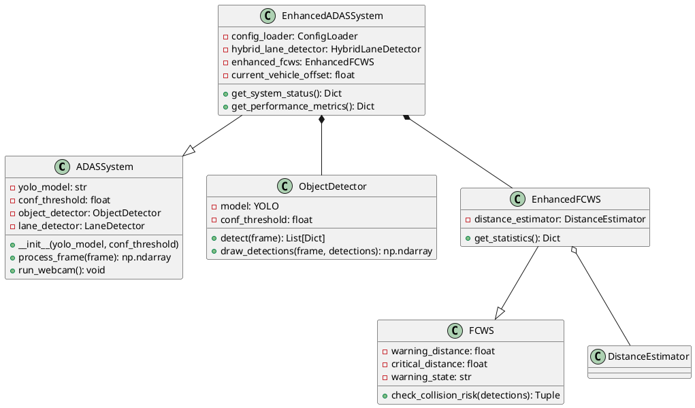
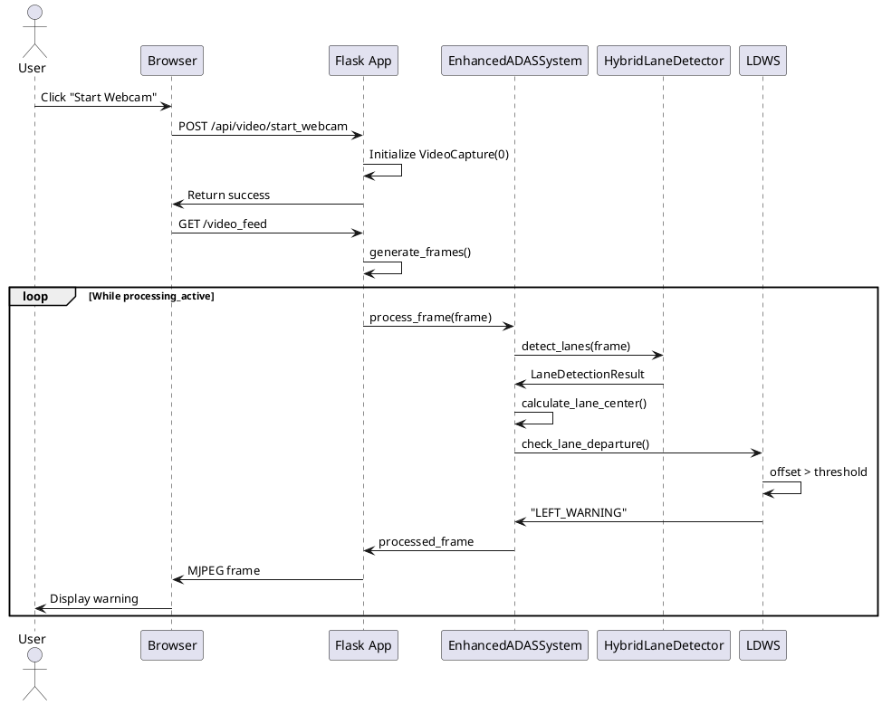
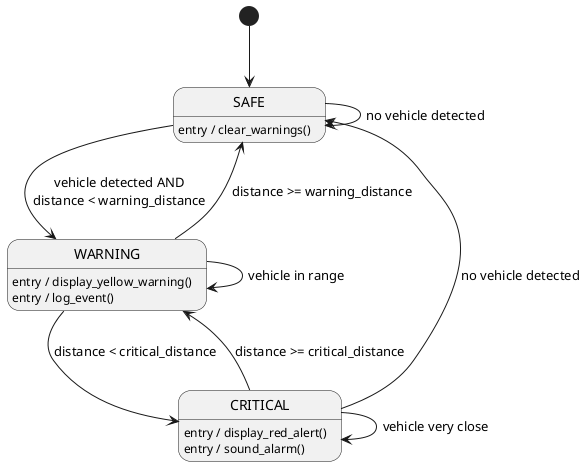

# UML Diagram Creation Guide

## 9 Types of UML Diagrams for ADAS Project

This guide provides specific instructions for creating each of the 9 UML diagram types for the ADAS project.

---

## 1. CLASS DIAGRAM

### Purpose
Show the static structure of the system with classes, attributes, methods, and relationships.

### Key Classes to Include

**Core Classes**:
- ADASSystem
- EnhancedADASSystem
- ObjectDetector
- LaneDetector
- HybridLaneDetector
- ONNXLaneDetector

**Warning Systems**:
- FCWS
- EnhancedFCWS
- LDWS
- LKAS

**Support Classes**:
- DistanceEstimator
- AdvancedOverlayRenderer
- AnimationEngine
- BirdEyeViewTransformer
- ConfigLoader
- ModelManager
- ErrorHandler

**Data Classes**:
- LaneDetectionResult
- DistanceEstimation
- OverlayConfig

### Relationships to Show

**Inheritance**:
- EnhancedADASSystem → ADASSystem
- EnhancedFCWS → FCWS

**Aggregation** (has-a, can exist independently):
- EnhancedADASSystem ◇→ ConfigLoader
- EnhancedADASSystem ◇→ ModelManager
- HybridLaneDetector ◇→ ONNXLaneDetector
- HybridLaneDetector ◇→ LaneDetector

**Composition** (has-a, cannot exist independently):
- EnhancedADASSystem ◆→ ObjectDetector
- EnhancedADASSystem ◆→ HybridLaneDetector
- EnhancedADASSystem ◆→ FCWS, LDWS, LKAS
- EnhancedADASSystem ◆→ AdvancedOverlayRenderer
- AdvancedOverlayRenderer ◆→ AnimationEngine

**Association**:
- EnhancedFCWS → DistanceEstimator
- Flask App → EnhancedADASSystem

**Dependency**:
- ObjectDetector ⋯→ YOLO (external library)
- ONNXLaneDetector ⋯→ onnxruntime

### Attributes & Methods Format
```
ClassName
─────────────────
- attribute: type
+ public_method(): return_type
- private_method(): return_type
# protected_method(): return_type
```

---

## 2. OBJECT DIAGRAM

### Purpose
Show a snapshot of objects and their relationships at a specific point in time.

### Scenario: "System Processing a Frame with Lane Departure Warning"

**Objects to Include**:
```
:EnhancedADASSystem
    current_vehicle_offset = 35.0
    processing_active = True

:HybridLaneDetector
    dl_enabled = True
    consecutive_failures = 0

:LaneDetector
    roi_vertices = [[...]]

:LDWS
    warning_state = "LEFT_WARNING"
    departure_count = 3
    departure_threshold = 30.0

:LKAS
    assist_active = True
    steering_angle = -15.5

:AdvancedOverlayRenderer
    config = {...}

:AnimationEngine
    animations = {"arrow_left": {...}}

frame1:np.ndarray
    shape = (720, 1280, 3)

result1:LaneDetectionResult
    confidence = 0.85
    success = True
    model_used = "dl"
```

**Links to Show**:
- :EnhancedADASSystem → :HybridLaneDetector
- :EnhancedADASSystem → :LDWS
- :EnhancedADASSystem → :LKAS
- :EnhancedADASSystem → :AdvancedOverlayRenderer
- :HybridLaneDetector → result1
- :LDWS → frame1

---

## 3. USE CASE DIAGRAM

### Purpose
Show interactions between actors and the system.

### Actors
- **Driver/User** (Primary)
- **System** (Secondary - automated actions)
- **Administrator** (Secondary - configuration)

### Use Cases

**Primary Use Cases**:
1. Start Webcam Processing
2. Upload Video File
3. Stop Processing
4. View Performance Metrics
5. Adjust System Settings

**System Use Cases** (automated):
6. Detect Objects
7. Detect Lanes
8. Issue Forward Collision Warning
9. Issue Lane Departure Warning
10. Provide Lane Keeping Assistance
11. Render Visual Overlays
12. Update Statistics

**Admin Use Cases**:
13. Configure System Parameters
14. View System Logs
15. Export Processing Report

### Relationships
- **Include**: "Upload Video File" includes "Validate File Format"
- **Extend**: "Issue Forward Collision Warning" extends "Detect Objects"
- **Generalization**: "Start Webcam" and "Upload Video" generalize to "Start Processing"

---

## 4. SEQUENCE DIAGRAM

### Scenario 1: "User Starts Webcam and Receives Lane Departure Warning"

**Participants**:
- User
- Browser
- Flask App
- EnhancedADASSystem
- HybridLaneDetector
- LDWS
- AdvancedOverlayRenderer

**Sequence**:
```
User → Browser: Click "Start Webcam"
Browser → Flask App: POST /api/video/start_webcam
Flask App → Flask App: Initialize VideoCapture(0)
Flask App → Browser: Return success
Browser → Flask App: GET /video_feed
Flask App → Flask App: generate_frames()
loop [While processing_active]
    Flask App → VideoCapture: read()
    VideoCapture → Flask App: frame
    Flask App → EnhancedADASSystem: process_frame(frame)
    EnhancedADASSystem → HybridLaneDetector: detect_lanes(frame)
    HybridLaneDetector → EnhancedADASSystem: LaneDetectionResult
    EnhancedADASSystem → EnhancedADASSystem: calculate_lane_center()
    EnhancedADASSystem → LDWS: check_lane_departure(center, offset)
    LDWS → LDWS: offset > threshold
    LDWS → LDWS: warning_state = "LEFT_WARNING"
    LDWS → EnhancedADASSystem: "LEFT_WARNING"
    EnhancedADASSystem → AdvancedOverlayRenderer: draw_directional_arrow()
    AdvancedOverlayRenderer → EnhancedADASSystem: frame with arrow
    EnhancedADASSystem → Flask App: processed_frame
    Flask App → Flask App: encode JPEG
    Flask App → Browser: MJPEG frame
    Browser → User: Display frame with warning
end
```

### Scenario 2: "Configuration Update"

**Participants**:
- User
- Browser
- Flask App
- ConfigLoader
- EnhancedADASSystem

**Sequence**:
```
User → Browser: Adjust setting slider
Browser → Flask App: POST /api/config/update {key: value}
Flask App → ConfigLoader: update_from_dict({key: value})
ConfigLoader → ConfigLoader: Validate value
ConfigLoader → ConfigLoader: Update config dict
ConfigLoader → ConfigLoader: save() to YAML
ConfigLoader → Flask App: Success
Flask App → EnhancedADASSystem: Apply new setting
EnhancedADASSystem → EnhancedADASSystem: Update component
Flask App → Browser: {status: "success"}
Browser → User: Show confirmation
```

---

## 5. ACTIVITY DIAGRAM

### Activity 1: "Frame Processing Workflow"

**Swimlanes**:
- EnhancedADASSystem
- Detection Components
- Warning Systems
- Rendering Components

**Activities**:
```
[Start]
    ↓
[Receive Frame]
    ↓
Fork into parallel activities:
    ├─ [Detect Objects] (ObjectDetector)
    └─ [Detect Lanes] (HybridLaneDetector)
    ↓
[Join: Both Complete]
    ↓
[Calculate Lane Metrics]
    ↓
Fork into parallel activities:
    ├─ [Check FCWS] (FCWS)
    ├─ [Check LDWS] (LDWS)
    └─ [Calculate LKAS] (LKAS)
    ↓
[Join: All Complete]
    ↓
[Estimate Distances] (DistanceEstimator)
    ↓
[Render Overlays] (AdvancedOverlayRenderer)
    ↓
Decision: [BEV Enabled?]
    ├─ Yes → [Transform to BEV] → [Add PIP]
    └─ No ↓
[Draw Status Panel]
    ↓
[Update Statistics]
    ↓
[Return Processed Frame]
    ↓
[End]
```

### Activity 2: "Error Handling and Recovery"

```
[Start: Error Detected]
    ↓
Decision: [Error Type?]
    ├─ Model Error
    │   ↓
    │   [Increment Error Counter]
    │   ↓
    │   Decision: [Counter > Threshold?]
    │   ├─ Yes → [Disable DL Model] → [Enable CV Fallback]
    │   └─ No → [Log Error] → [Continue]
    │
    ├─ Processing Error
    │   ↓
    │   [Increment Error Counter]
    │   ↓
    │   Decision: [Counter > Threshold?]
    │   ├─ Yes → [Enter Safe Mode]
    │   └─ No → [Skip Frame] → [Continue]
    │
    └─ Critical Error
        ↓
        [Stop Processing]
        ↓
        [Display Error Message]
        ↓
        [End]
```

---

## 6. STATE MACHINE DIAGRAM

### State Machine 1: "FCWS State Machine"

**States**:
- SAFE (initial state)
- WARNING
- CRITICAL

**Transitions**:
```
SAFE
    ├─ [vehicle detected AND distance < warning_distance] → WARNING
    └─ [no vehicle detected] → SAFE (self-loop)

WARNING
    ├─ [distance < critical_distance] → CRITICAL
    ├─ [distance >= warning_distance] → SAFE
    └─ [vehicle still in range] → WARNING (self-loop)

CRITICAL
    ├─ [distance >= critical_distance] → WARNING
    ├─ [no vehicle detected] → SAFE
    └─ [vehicle still very close] → CRITICAL (self-loop)
```

**Actions**:
- On enter WARNING: display_yellow_warning(), log_event()
- On enter CRITICAL: display_red_alert(), sound_alarm()
- On enter SAFE: clear_warnings()

### State Machine 2: "Video Processing State Machine"

**States**:
- IDLE (initial state)
- INITIALIZING
- PROCESSING
- PAUSED
- ERROR
- STOPPED (final state)

**Transitions**:
```
IDLE
    └─ [start_webcam OR upload_video] → INITIALIZING

INITIALIZING
    ├─ [initialization success] → PROCESSING
    └─ [initialization failure] → ERROR

PROCESSING
    ├─ [stop_video] → STOPPED
    ├─ [pause_video] → PAUSED
    └─ [processing error] → ERROR

PAUSED
    ├─ [resume_video] → PROCESSING
    └─ [stop_video] → STOPPED

ERROR
    ├─ [retry] → INITIALIZING
    └─ [stop] → STOPPED

STOPPED
    └─ [restart] → IDLE
```

---

## 7. COMPONENT DIAGRAM

### Purpose
Show the organization and dependencies among software components.

### Components

**Presentation Layer**:
```
┌─────────────────────────┐
│   Web UI Component      │
│  ┌──────────────────┐   │
│  │ dashboard.html   │   │
│  │ dashboard.css    │   │
│  │ dashboard.js     │   │
│  └──────────────────┘   │
│  Provides: IUserInterface│
│  Requires: IWebAPI      │
└─────────────────────────┘
```

**Application Layer**:
```
┌─────────────────────────┐
│  Flask Server Component │
│  ┌──────────────────┐   │
│  │ app.py           │   │
│  │ Routes           │   │
│  │ API Endpoints    │   │
│  └──────────────────┘   │
│  Provides: IWebAPI      │
│  Requires: IADASProcessing│
└─────────────────────────┘
```

**Business Logic Layer**:
```
┌─────────────────────────┐
│ ADAS Processing Component│
│  ┌──────────────────┐   │
│  │enhanced_adas_    │   │
│  │  system.py       │   │
│  └──────────────────┘   │
│  Provides: IADASProcessing│
│  Requires: IDetection,  │
│           IWarning,     │
│           IRendering    │
└─────────────────────────┘
```

**Detection Layer**:
```
┌──────────────────────┐  ┌──────────────────────┐
│ Object Detection     │  │ Lane Detection       │
│ Component            │  │ Component            │
│  ┌────────────────┐  │  │  ┌────────────────┐  │
│  │object_detector │  │  │  │hybrid_lane_    │  │
│  │  .py           │  │  │  │  detector.py   │  │
│  └────────────────┘  │  │  └────────────────┘  │
│  Provides:           │  │  Provides:           │
│    IObjectDetection  │  │    ILaneDetection    │
│  Requires: YOLOv8    │  │  Requires: ONNX,CV   │
└──────────────────────┘  └──────────────────────┘
```

**Warning Systems Layer**:
```
┌──────────────────────┐
│ Warning Systems      │
│ Component            │
│  ┌────────────────┐  │
│  │ fcws.py        │  │
│  │ ldws.py        │  │
│  │ lkas.py        │  │
│  └────────────────┘  │
│  Provides: IWarning  │
│  Requires: IDetection│
└──────────────────────┘
```

**Rendering Layer**:
```
┌──────────────────────┐
│ Rendering Component  │
│  ┌────────────────┐  │
│  │advanced_overlay│  │
│  │  .py           │  │
│  │animation_engine│  │
│  │  .py           │  │
│  └────────────────┘  │
│  Provides: IRendering│
│  Requires: OpenCV    │
└──────────────────────┘
```

**Utilities Layer**:
```
┌──────────────────────┐
│ Configuration        │
│ Component            │
│  ┌────────────────┐  │
│  │config_loader.py│  │
│  └────────────────┘  │
│  Provides: IConfig   │
│  Requires: YAML      │
└──────────────────────┘
```

### Dependencies
- Web UI → Flask Server
- Flask Server → ADAS Processing
- ADAS Processing → Detection Components
- ADAS Processing → Warning Systems
- ADAS Processing → Rendering
- ADAS Processing → Configuration

---

## 8. DEPLOYMENT DIAGRAM

### Purpose
Show the physical deployment of artifacts on nodes.

### Nodes and Artifacts

**Client Node** (User's Computer):
```
┌─────────────────────────────────┐
│  <<device>>                     │
│  Client Computer                │
│  ┌───────────────────────────┐  │
│  │ <<execution environment>> │  │
│  │ Web Browser               │  │
│  │  ┌─────────────────────┐  │  │
│  │  │ <<artifact>>        │  │  │
│  │  │ dashboard.html      │  │  │
│  │  │ dashboard.css       │  │  │
│  │  │ dashboard.js        │  │  │
│  │  └─────────────────────┘  │  │
│  └───────────────────────────┘  │
└─────────────────────────────────┘
```

**Server Node** (Processing Server):
```
┌─────────────────────────────────┐
│  <<device>>                     │
│  Server Computer                │
│  OS: Windows/Linux              │
│  CPU: Intel i7/AMD Ryzen        │
│  RAM: 16GB                      │
│  ┌───────────────────────────┐  │
│  │ <<execution environment>> │  │
│  │ Python 3.8+               │  │
│  │  ┌─────────────────────┐  │  │
│  │  │ <<artifact>>        │  │  │
│  │  │ app.py              │  │  │
│  │  │ enhanced_adas_      │  │  │
│  │  │   system.py         │  │  │
│  │  │ *.py (modules)      │  │  │
│  │  └─────────────────────┘  │  │
│  └───────────────────────────┘  │
│  ┌───────────────────────────┐  │
│  │ <<artifact>>              │  │
│  │ yolov8n.pt                │  │
│  │ lane_detection.onnx       │  │
│  │ adas_config.yaml          │  │
│  └───────────────────────────┘  │
└─────────────────────────────────┘
```

**GPU Node** (Optional):
```
┌─────────────────────────────────┐
│  <<device>>                     │
│  NVIDIA GPU                     │
│  Model: GTX 1060 / RTX 3050     │
│  VRAM: 6GB+                     │
│  ┌───────────────────────────┐  │
│  │ <<execution environment>> │  │
│  │ CUDA 11.x                 │  │
│  │  ┌─────────────────────┐  │  │
│  │  │ YOLOv8 Inference    │  │  │
│  │  │ ONNX Inference      │  │  │
│  │  └─────────────────────┘  │  │
│  └───────────────────────────┘  │
└─────────────────────────────────┘
```

**Camera Node**:
```
┌─────────────────────────────────┐
│  <<device>>                     │
│  Webcam / Video File            │
│  Resolution: 720p/1080p         │
│  FPS: 30                        │
└─────────────────────────────────┘
```

### Communication Paths
- Client ←HTTP/HTTPS→ Server
- Client ←MJPEG Stream→ Server
- Server ←USB/File→ Camera
- Server ←PCIe→ GPU

---


## 9. COMMUNICATION DIAGRAM (Collaboration Diagram)

### Purpose
Show interactions between objects with emphasis on structural organization.

### Scenario: "Processing Frame with Collision Warning"

**Objects and Links**:
```
1: process_frame(frame)
┌──────────────────────┐
│ :Flask App           │
└──────────────────────┘
         │
         │ 1: process_frame(frame)
         ↓
┌──────────────────────┐
│ :EnhancedADASSystem  │
└──────────────────────┘
    │              │
    │ 2: detect()  │ 3: detect_lanes()
    ↓              ↓
┌─────────────┐  ┌──────────────────┐
│:ObjectDetector│ │:HybridLaneDetector│
└─────────────┘  └──────────────────┘
    │                    │
    │ 2.1: return        │ 3.1: return
    │ detections         │ LaneDetectionResult
    ↓                    ↓
┌──────────────────────┐
│ :EnhancedADASSystem  │
└──────────────────────┘
    │              │
    │ 4: check()   │ 5: estimate()
    ↓              ↓
┌─────────────┐  ┌──────────────────┐
│ :EnhancedFCWS│  │:DistanceEstimator│
└─────────────┘  └──────────────────┘
    │                    │
    │ 4.1: return        │ 5.1: return
    │ (WARNING, risks)   │ distances
    ↓                    ↓
┌──────────────────────┐
│ :EnhancedADASSystem  │
└──────────────────────┘
         │
         │ 6: draw_warning()
         ↓
┌──────────────────────┐
│:AdvancedOverlayRenderer│
└──────────────────────┘
         │
         │ 6.1: return frame
         ↓
┌──────────────────────┐
│ :EnhancedADASSystem  │
└──────────────────────┘
         │
         │ 7: return processed_frame
         ↓
┌──────────────────────┐
│ :Flask App           │
└──────────────────────┘
```

**Message Numbering**:
- 1: process_frame(frame)
- 2: detect(frame)
  - 2.1: return detections
- 3: detect_lanes(frame)
  - 3.1: return LaneDetectionResult
- 4: check_collision_risk(detections)
  - 4.1: return (WARNING, risky_detections)
- 5: estimate_distance(detection)
  - 5.1: return distance_dict
- 6: draw_warning_overlay(frame, WARNING)
  - 6.1: return frame_with_overlay
- 7: return processed_frame

---

## ADDITIONAL DIAGRAMS (Optional but Recommended)

### 10. PACKAGE DIAGRAM

**Purpose**: Show the organization of packages and their dependencies.

```
┌─────────────────────────────────────────────────┐
│              ADAS_Project                       │
│  ┌──────────────────────────────────────────┐  │
│  │         web_application                  │  │
│  │  ┌────────┐  ┌────────┐  ┌────────┐     │  │
│  │  │ app.py │  │templates│  │ static │     │  │
│  │  └────────┘  └────────┘  └────────┘     │  │
│  └──────────────────────────────────────────┘  │
│                    │ depends on                │
│  ┌──────────────────────────────────────────┐  │
│  │         core_adas                        │  │
│  │  ┌────────────────┐  ┌────────────────┐  │  │
│  │  │ main.py        │  │ enhanced_adas_ │  │  │
│  │  │                │  │   system.py    │  │  │
│  │  └────────────────┘  └────────────────┘  │  │
│  └──────────────────────────────────────────┘  │
│         │                    │                 │
│         │ depends on         │ depends on      │
│         ↓                    ↓                 │
│  ┌──────────────┐    ┌──────────────┐         │
│  │  detection   │    │warning_systems│         │
│  │  ┌────────┐  │    │  ┌────────┐  │         │
│  │  │object_ │  │    │  │ fcws   │  │         │
│  │  │detector│  │    │  │ ldws   │  │         │
│  │  │lane_   │  │    │  │ lkas   │  │         │
│  │  │detector│  │    │  └────────┘  │         │
│  │  └────────┘  │    └──────────────┘         │
│  └──────────────┘                              │
│         │                    │                 │
│         │ depends on         │ depends on      │
│         ↓                    ↓                 │
│  ┌──────────────┐    ┌──────────────┐         │
│  │  dl_models   │    │  rendering   │         │
│  │  ┌────────┐  │    │  ┌────────┐  │         │
│  │  │onnx_   │  │    │  │advanced│  │         │
│  │  │lane_   │  │    │  │overlay │  │         │
│  │  │detector│  │    │  │animation│  │         │
│  │  └────────┘  │    │  │bev_    │  │         │
│  └──────────────┘    │  │transform│  │         │
│                      │  └────────┘  │         │
│                      └──────────────┘         │
│                             │                 │
│                             │ depends on      │
│                             ↓                 │
│                      ┌──────────────┐         │
│                      │    utils     │         │
│                      │  ┌────────┐  │         │
│                      │  │config_ │  │         │
│                      │  │loader  │  │         │
│                      │  │distance│  │         │
│                      │  │estimator│ │         │
│                      │  │model_  │  │         │
│                      │  │manager │  │         │
│                      │  │error_  │  │         │
│                      │  │handler │  │         │
│                      │  └────────┘  │         │
│                      └──────────────┘         │
└─────────────────────────────────────────────────┘
```

---

## DIAGRAM CREATION TIPS

### Tools Recommended
1. **PlantUML** - Text-based, version control friendly
2. **Draw.io** - Free, web-based, easy to use
3. **Lucidchart** - Professional, collaborative
4. **Visual Paradigm** - Comprehensive UML tool
5. **StarUML** - Desktop application

### Best Practices

**For All Diagrams**:
- Use consistent naming conventions
- Keep diagrams focused (one main concept per diagram)
- Use appropriate level of detail
- Add notes/comments for clarity
- Use standard UML notation

**Class Diagram**:
- Show only relevant attributes/methods
- Group related classes
- Use packages to organize
- Show multiplicities on associations

**Sequence Diagram**:
- Order participants logically (left to right)
- Use activation boxes for active processing
- Show return messages
- Use fragments (alt, loop, opt) appropriately

**Activity Diagram**:
- Use swimlanes for different actors/components
- Show decision points clearly
- Indicate parallel activities with forks/joins
- Mark start and end states

**State Machine Diagram**:
- Show all possible states
- Label transitions with events/conditions
- Include entry/exit actions
- Show initial and final states

---

## EXAMPLE PLANTUML CODE

### Class Diagram Example


### Sequence Diagram Example


### State Machine Example


---

## CHECKLIST FOR EACH DIAGRAM

### Before Creating
- [ ] Understand the purpose of the diagram
- [ ] Identify key elements to include
- [ ] Determine appropriate level of detail
- [ ] Choose the right tool

### During Creation
- [ ] Follow UML notation standards
- [ ] Use consistent naming
- [ ] Keep it readable (not too cluttered)
- [ ] Add necessary labels and notes

### After Creation
- [ ] Review for accuracy
- [ ] Verify relationships are correct
- [ ] Check for completeness
- [ ] Get feedback from team
- [ ] Update documentation

---

## SUBMISSION CHECKLIST

For your software engineering project submission, ensure you have:

- [ ] 1. Class Diagram (showing all major classes and relationships)
- [ ] 2. Object Diagram (showing runtime instance snapshot)
- [ ] 3. Use Case Diagram (showing all user interactions)
- [ ] 4. Sequence Diagram (at least 2 scenarios)
- [ ] 5. Activity Diagram (showing main workflows)
- [ ] 6. State Machine Diagram (for FCWS, LDWS, or processing states)
- [ ] 7. Component Diagram (showing system architecture)
- [ ] 8. Deployment Diagram (showing physical deployment)
- [ ] 9. Communication Diagram (showing object interactions)

**Optional but Recommended**:
- [ ] Package Diagram (showing code organization)
- [ ] Timing Diagram (showing performance constraints)

---

## REFERENCES

- UML 2.5 Specification: https://www.omg.org/spec/UML/
- PlantUML Documentation: https://plantuml.com/
- UML Distilled by Martin Fowler
- Applying UML and Patterns by Craig Larman

---

**Good luck with your UML diagrams!** 🎨📊
